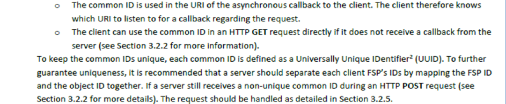
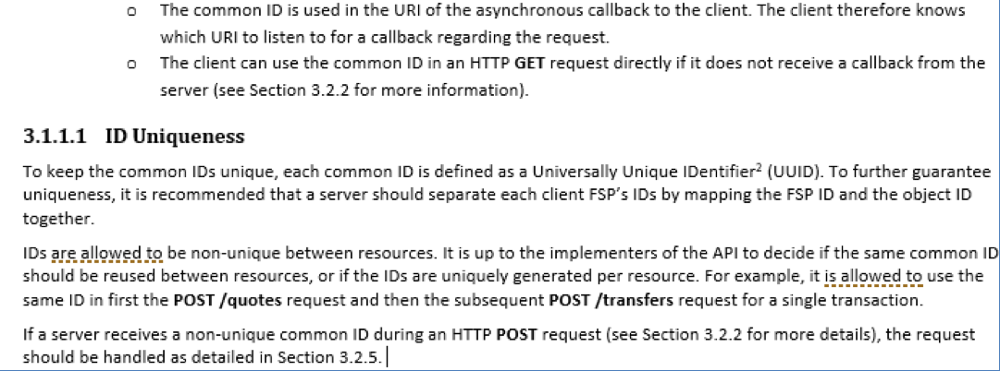
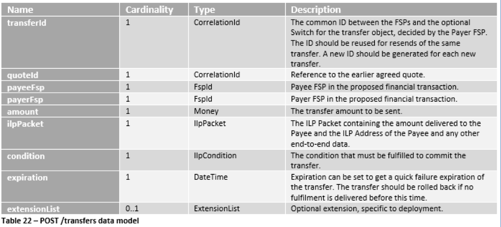

## **\[Change ID\] -- \[Change Request Name\]**
___

### *Open API for FSP Interoperability -- Solution Proposal*

### **Table of Contents**

- [1. Preface](#1-preface)
  - [1.1 Solution Proposal Information](#11-solution-proposal-information)
  * [1.2 Document Version Information](#12-document-version-information)
* [2. Change Request](#2-change-request)
  * [2.1 Background](#21-background)
* [3. Proposed Solution](#3-proposed-solution)
  * [3.1 Specify how IDs can be generated](#31-specify-how-ids-can-be-generated)
  * [3.2 Add quote ID to POST /transfers data model](#32-add-quote-id-to-post-transfers-data-model)
* [4. Other Considered Solutions](#4-other-considered-solutions)
  * [4.1 Add transaction ID to the POST /transfers data model](#41-add-transaction-id-to-the-post-transfers-data-model)
  * [4.2 Force the Payer FSP to use the transaction ID as transfer ID](#42-force-the-payer-fsp-to-use-the-transaction-id-as-transfer-id)

## **1. Preface**
___

This section contains basic information regarding the solution proposal.

#### 1.1 Solution Proposal Information

| | |
|---|---|
| Change Request ID | TEMPLATE\_1 |
| Change Request Name | Template for Change Request |
| Prepared By | Henrik Karlsson, Ericsson |
| Solution Proposal Status | In review [X] / Approved [ ] / Rejected [ ] |
| Approved/Rejected Date |

#### 1.2 Document Version Information

| Version | Date | Author | Change Description |
|---|---|---|---|
| 1.0 | 2019-02-05 | Henrik Karlsson | Initial version of template. Sent out for review. |

## **2. Change Request**
___

#### 2.1 Background

Explain the background of the change request (can be a copy of the
background in the accepted Change Request).

**Example**:

In order to process a **POST** message on the **/transfers** resource
(hereafter referred to as the *transfer request*) correctly, the Payee
FSP must be able to ascertain which **PUT** message on the **/quotes**
resource (hereafter referred to as the *quote response*) was used as the
authorization for the transfer request. There are two reasons for this:

1.  The open fields of the transfer request do not contain all of the
    information which the Payee FSP needs to know in order to complete
    the transfer. For example, the identification of the Payee is
    contained in the request for quotation, but not in the open fields
    of the transfer request.

2.  The Payee FSP needs to be able to identify which private key was
    used to sign the data for the quote response and produce the
    condition and fulfilment. Unless we insist that a FSP only ever use
    one private key for this task, it will be necessary to make the
    connection between the quote response and the transfer request. As
    the specification itself says in Section 6.5.1.2: "The choice and
    cardinality of the local secret is an implementation decision that
    may be driven by scheme rules. The only requirement is that the
    Payee FSP can determine which secret that was used when the ILP
    Packet is received back later as part of an incoming transfer."

At present, the quote response contains an ILP packet, which contains a
data field and a condition. The data field contains an encoded version
of the original request for quotation, and the condition is the result
of signing that data with a private key. Assuming that the Payee FSP has
saved some information relating to the original request for quotation,
and assuming further that this will be searchable on a unique component
of the request for quotation, it would be possible for the Payee FSP to
reconstitute the original request for payment and abstract the unique
code from it.

However, this is not an efficient way of proceeding. This connection
must be established for every transfer request, since there is no other
way of knowing which private key to apply. It therefore makes good sense
to provide a quick and simple way of connecting the transfer request
with the quote response that was used to authorize it.

## **3. Proposed Solution**
___

This section should contain the proposed solution by describing what
needs to be changed in the current specification, and in which
document(s) of the specification that needs to be updated. If any
resources requires a new version, minor or major, as per the change then
include that information.

**Example:**

The proposed solution is divided into two parts, specifiying how IDs are
allowed to be generated by implementers and adding the quote id to the
**POST /transfers** request.

#### 3.1 Specify how IDs can be generated

Currently the API Definition does not specify in which way an
implementation can generate the unique IDs in Section 3.1.1 in *API
Definition*. The proposal is to add a new subsection detailing that IDs
are allowed to be non-unique between resources (as in the same ID is
used in both quote, transfer, and transaction), or that they can be
unique among all resources.

#### 3.1.1 Current text

Figure 1 -- Current text in Section 3.1.1

#### 3.1.2 New proposed text

Figure2  -- New proposed text in Section 3.1.1 including more information
on uniqueness of IDs

#### 3.2 Add quote ID to POST /transfers data model

To be able to easily connect a **POST /transfers** request to the
earlier processed quote without decoding the ILP Packet, the quote ID
should be added to the **POST /transfers** data model. This change must
both update the *API Definition* and the *Logical Data Model* document,
so that they are aligned.

This change will require a new major version of the **transfers**
resource, from version 1.0 to version 2.0.

#### 3.2.1 Current POST /transfers data model

Figure 3 -- Current POST /transfers data model

#### 3.2.2 Proposed POST /transfers data model

Figure 4 -- Proposed POST /transfers data model including the quoteId

## **4. Other Considered Solutions**
___

If any alternative solutions have been investigated, they should be
described in this section for reference.

**Example:**

The following subsections describes the considered alternative
solutions.

#### 4.1 Add transaction ID to the POST /transfers data model

As an alternative to adding the quote ID to the **POST /transfers** data
model, the transaction ID could be added to the **POST /transfers** data
model instead which is also sent in the **POST /quotes** request. This
option was not preferred though as the **POST /transfers** is executing
on an earlier proposed quote, why it is more logical to add the quote ID
instead of the transaction ID.

#### 4.2 Force the Payer FSP to use the transaction ID as transfer ID

Another alternative was to introduce logic in the API that a Payer FSP
was required to use the transaction ID from the **POST /quotes** as the
transfer ID in the **POST /transfers** request. Adding this type of
logic is not according to how the API currently works. It would also
require a change in existing implementations of the API.
