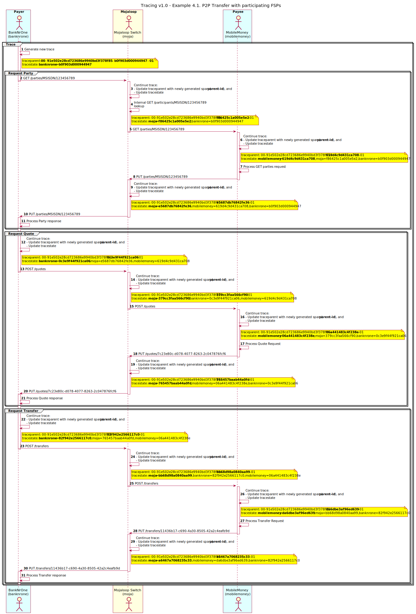
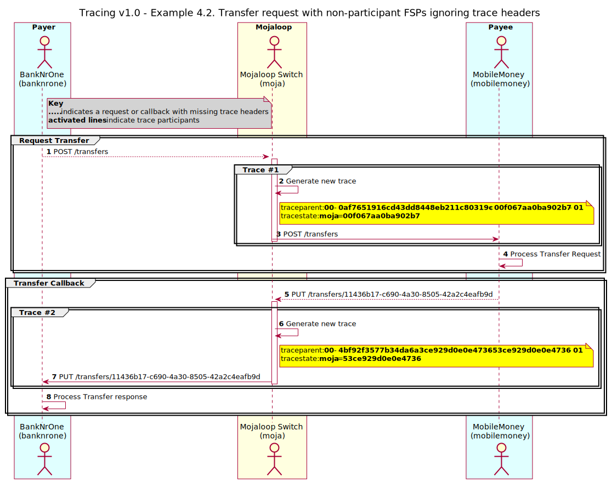

@@ -0,0 +1,215 @@
---
showToc: true
---
# Distributed Tracing Support for OpenAPI Interoperability

## _Tracing for the OpenAPI Interoperability Specification_


**Table of Content**

1. [Preface](#1-preface)

    1.1 [Conventions Used in This Document](#11-conventions-used-in-this-document)

    1.2 [Document Version Information](#12-document-version-information)

2. [Introduction](2-introduction)

    2.1 [Open API for FSP Interoperability Specification](#21-open-api-for-fsp-interoperability-specification)

3. [Tracing Specification](#3-tracing-specification)

    3.1 [Tracing Data Model](#31-tracing-data-model)

    3.2 [Generating a Trace](#32-generating-a-trace)

    3.3 [Continuing a Trace](#33-continuing-a-trace)

    3.4 [Forwarding a Trace](#34-forwarding-a-trace)

4. [Examples](#4-examples)

    4.1 [P2P Transfer with participating FSPs](#41-p2p-transfer-with-participating-fsps)

    4.2 [Transfer request with FSPs supporting trace header forwarding](#42-transfer-request-with-fsps-supporting-trace-header-forwarding)

    4.3 [Transfer request with non-participant FSPs ignoring trace headers](#43-transfer-request-with-non-participant-fsps-ignoring-trace-headers)

5. [References](#5-references)

**Table of Tables**

[Table 1 – Data model of HTTP header fields for Tracing](#table-1-–-data-model-of-http-header-fields-for-Tracing)<br/>
[Table 2 – Data model for Tracing values](#table-2-–-data-model-for-tracing-values)<br/>
[Table 3 – Supported version-formats](#table-3-–-supported-version-formats)<br/>
[Table 4 – Data model for _tracestate_ list member values](#table-4-–-data-model-for-tracestate-list-member-values)<br/>
[Table 5 – P2P Transfer Participants](#table-5-–-p2p-transfer-participants)<br/>

## 1. Preface

This section contains information about how to use this document.

### 1.1 Conventions Used in This Document

This document uses the notational conventions for **2HEXDIGLC**, **16HEXDIGLC** and **32HEXDIGLC** defined in W3C Trace Context Recommendation <sup>[1](https://www.w3.org/TR/trace-context-1/#traceparent-header-field-values)</sup>.

The following conventions are used in this document to identify the specified types of information.

|Type of Information|Convention|Example|
|---|---|---|
|**Elements of the API, such as resources**|Boldface|**/authorization**|
|**Variables**|Italics within curly brackets|_{ID}_|
|**Glossary terms**|Italics on first occurrence; defined in _Glossary_|The purpose of the API is to enable interoperable financial transactions between a _Payer_ (a payer of electronic funds in a payment transaction) located in one _FSP_ (an entity that provides a digital financial service to an end user) and a _Payee_ (a recipient of electronic funds in a payment transaction) located in another FSP.|
|**Library documents**|Italics|User information should, in general, not be used by API deployments; the security measures detailed in _API Signature_ and _API Encryption_ should be used instead.|

### 1.2 Document Version Information

|Version|Date|Change Description|
|---|---|---|
|**1.0**|2021-06-01|Initial version|
| | | |

## 2. Introduction

This document details the Distributed Tracing standards to be supported for the Mojaloop API Suite to ensure _tracing_ and _observability_ within the API system, and to/from API consumers.

Distributed Tracing is a method to monitor a request end-to-end from the source to the destination, including any participating actors/components that process or forward the request. This helps to pinpoint where failures and poor performance of a specific request have occurred. As such this method is well suited to a modern microservice architecture which includes distributed application components. In addition it also supports the inclusion of both API consumers which can be both internal and external (referred to as _vendors_). Vendors may participate either by continuing the trace, or forwarding the received tracing information without modification.

## 3. Tracing Specification

This section introduces Distributed Tracing from a Mojaloop context, including the header format, and the mechanisms used to generate, continue and forward traces.

### 3.1 Tracing Data Model

[Table 1](#table-1-–-data-model-of-http-header-fields-for-Tracing) describes the trace headers fields that are optionally included in each API request. Tables [2](#table-2-–-data-model-for-tracing-values), [3](#table-3-–-supported-version-formats), and [4](#table-4-–-data-model-for-tracestate-list-member-values) describes the associated values and properties that is contained by each of the respective trace header fields shown in [Table 1](#table-1-–-data-model-of-http-header-fields-for-Tracing).

#### **Table 1 – Data model of HTTP header fields for Tracing**

| Name | Cardinality | Type | Description | Reference |
| --- | --- | --- | --- | --- |
| traceparent | 1 | String(55) | Incoming request containing the trace information, including the _version_ and populated _version-format_ values.<br/>Format: _{version}_-_{version-format}_.<br/>Example: `00-4bf92f3577b34da6a3ce929d0e0e4736-00f067aa0ba902b7-01` | Sections _[3.2.2 traceparent Header Field Values](https://www.w3.org/TR/trace-context-1/#traceparent-header-field-values)_ <sup>[1](https://www.w3.org/TR/trace-context-1/#traceparent-header-field-values)</sup> |
| tracestate | 0...1 | String(512), <br/>list-member-keyvalue(0...32) | Provides optional vendor-specific trace information, and support for multiple distributed traces. It should only be propagated if and only if the value contains non-empty list (max of 32) of _list-member-keyvalue_'s (Refer to [Table 4](#table-4-–-data-model-for-tracestate-list-member-values)) that are comma (`,`) separated.<br/>Format: _{list-member-keyvalue}_,_{list-member-keyvalue}_,_{list-member-keyvalue}_. If the value of the traceparent field wasn't changed before propagation, tracestate MUST NOT be modified as well. <br/>Example: `vendorname1=opaqueValue1,vendorname2=opaqueValue2` | Section _[3.3 Tracestate Header](https://www.w3.org/TR/trace-context-1/#tracestate-header)_ <sup>[1](https://www.w3.org/TR/trace-context-1/#tracestate-header)</sup> |

Table 1 – Data model of HTTP header fields for Tracing

#### **Table 2 – Data model for Tracing values**

| Name | Cardinality | Type | Description | Reference |
| --- | --- | --- | --- | --- |
| version | 1 | 2HEXDIGLC | Version indicator for trace-format. Refer to [Table 3](#table-3-–-supported-version-formats) for supported versions. | Section _[3.2.2.1 version](https://www.w3.org/TR/trace-context-1/#version)_ <sup>[1](https://www.w3.org/TR/trace-context-1/#version)</sup> |
| version-format | 1 | String(52) | A _dash_ (`-`) delimitated string included tracing information such as: trace-id, parent-id, trace-flags, etc. | Refer to [Table 3](#table-3-–-supported-version-formats) |
| trace-id | 1 | 32HEXDIGLC | [Randomly generated ID](https://www.w3.org/TR/trace-context-1/#considerations-for-trace-id-field-generation)<sup>[1](https://www.w3.org/TR/trace-context-1/#considerations-for-trace-id-field-generation)</sup> representing the entire trace, i.e. the end-to-end trace identifier. | Section _[3.2.2.3 trace-id](https://www.w3.org/TR/trace-context-1/#trace-id)_ <sup>[1](https://www.w3.org/TR/trace-context-1/#trace-id)</sup> |
| parent-id | 1 | 16HEXDIGLC | ID representing a _span_, the primary building block of a distributed trace, representing an individual unit of work done in a distributed system. It is recommended to follow the same [consideration for ID generation](https://www.w3.org/TR/trace-context-1/#considerations-for-trace-id-field-generation)<sup>[1](https://www.w3.org/TR/trace-context-1/#considerations-for-trace-id-field-generation)</sup> as the _trace-id_ field.  | Section _[3.2.2.4 parent-id](https://www.w3.org/TR/trace-context-1/#parent-id)_ <sup>[1](https://www.w3.org/TR/trace-context-1/#parent-id)</sup> |
| trace-flags | 1 | 2HEXDIGLC | Control flags related to the trace. | Section _[3.2.2.5 trace-flags](https://www.w3.org/TR/trace-context-1/#trace-flags)_ <sup>[1](https://www.w3.org/TR/trace-context-1/#trace-flags)</sup> |

#### **Table 3 – Supported version-formats**

| Version | Format | Regex | Reference |
| --- | --- | --- | --- |
| 00 | {trace-id}_-_{parent-id}_-_{trace-flags} | `[0-9a-f]{32}-[0-9a-f]{16}-[0-9a-f]{2}` | Section _[3.2.2.2 version-format](https://www.w3.org/TR/trace-context-1/#version-format)_ <sup>[1](https://www.w3.org/TR/trace-context-1/#version-format)</sup> |

#### **Table 4 – Data model for _tracestate_ list member values**

| Name | Cardinality | Type | Description | Reference |
| --- | --- | --- | --- | --- |
| list-member-keyvalue | 1 | String(3...512) | Key-value pair joined by `=`, describing _vendor_ specific tracing information.<br/>Format: _{vendor-name}_=_{vendor-value}_<br/>Example: `vendorname1=opaqueValue1`  | Section _[3.3.1.3 list-members](https://www.w3.org/TR/trace-context-1/#list)_ <sup>[1](https://www.w3.org/TR/trace-context-1/#list) |
| vendor-name | 1 | String(1..256) | Vendor (list-member) identifier which is printable lowercase ASCII which only includes `a-z`, `0-9`, underscores (`_`), dashes (`-`), asterisks (`*`), and forward slashes (`/`). The _FSP_ or _Hub_ identifier should be used here. | Section _[3.3.1.3.1 Key](https://www.w3.org/TR/trace-context-1/#key)_ <sup>[1](https://www.w3.org/TR/trace-context-1/#key) |
| vendor-value | 1 | String(1..256) |  Opaque printable ASCII string excluding comma (`,`), equals (`=`), tabs, newlines, and carriage returns. | Section _[3.3.1.3.2 Value](https://www.w3.org/TR/trace-context-1/#value)_ <sup>[1](https://www.w3.org/TR/trace-context-1/#value) |

### 3.2 Creating a Trace

To create a trace, the following steps are performed:

3.2.1. Generate the _traceparent_ ([Table 1](#table-1-–-data-model-of-http-header-fields-for-Tracing)) header with the following values:
   > 3.2.1.1. Set the _version_ ([Table 2](#table-2-–-data-model-for-tracing-values)) to `00`.<br/>
   > 3.2.1.2. Generate the _trace-id_ ([Table 2](#table-2-–-data-model-for-tracing-values)) to represent the entire end-to-end trace.<br/>
   > 3.2.1.3. Generate a _parent-id_ ([Table 2](#table-2-–-data-model-for-tracing-values)) to represent a distribute portion of the trace.<br/>
   > 3.2.2.4 Set _trace-flags_ ([Table 2](#table-2-–-data-model-for-tracing-values)) to `01` to indicate if the trace was sampled by the source, otherwise to `00`.<br/>

3.2.2. Generate the _tracestate_ header, value below is for example purposes only as it is vendor specific: 
   > 3.2.2.1. Add a _list-member-keyvalue_ ([Table 4](#table-4-–-data-model-for-tracestate-list-member-values)) with value `{vendor-name}=BASE64Encoded({parent-id})`, where _vendor-name_ ([Table 4](#table-4-–-data-model-for-tracestate-list-member-values)) is the FSP or Hub identifier and _vendor-value_ ([Table 4](#table-4-–-data-model-for-tracestate-list-member-values)) being `BASE64Encoded({parent-id})` with the operation to base64 encode the _parent-id_ ([Table 2](#table-2-–-data-model-for-tracing-values)). Base64 encoding the list member value is optional but required if its contents is not printable ASCII<sup>[1](https://www.w3.org/TR/trace-context-1/#value)</sup>.

### 3.3 Continuing a Trace

To continue a trace, the following steps are performed:

3.3.1. Mutate the _traceparent_ ([Table 1](#table-1-–-data-model-of-http-header-fields-for-Tracing)) header with the following values:
   > 3.3.1.1. _version_ ([Table 2](#table-2-–-data-model-for-tracing-values)) is unchanged.<br/>
   > 3.3.1.2. _trace-id_ ([Table 2](#table-2-–-data-model-for-tracing-values)) is unchanged.<br/>
   > 3.3.1.3. Generate a _parent-id_ ([Table 2](#table-2-–-data-model-for-tracing-values)) representing a specific span (i.e. portion) of the end-to-end trace.<br/>
   > 3.3.2.4 Set _trace-flags_ ([Table 2](#table-2-–-data-model-for-tracing-values)) to `01` to indicate if the trace was sampled by the source, otherwise to `00`.<br/>

3.3.2. Mutate the _tracestate_ ([Table 1](#table-1-–-data-model-of-http-header-fields-for-Tracing)) header with the following:
   > 3.3.2.1. Add or update (if it already exists) list member `{VENDOR}=BASE64Encoded({parent-id})`, where `BASE64Encoded({string-value})` is the operation to base 64 encode the input `string-value` to the _tracestate_ header field. Ensure that the added or updated list member is inserted/moved to the front<sup>[1](https://www.w3.org/TR/trace-context-1/#value)</sup> of the list.
   > 3.3.2.1. Ensure _tracestate_ is less than 512 characters. If necessary remove the last list members until the 512 character limit has been reached <sup>[1](https://www.w3.org/TR/trace-context-1/#tracestate-limits)</sup>.

### 3.4. Forwarding a Trace

Vendors receiving trace request headers ([Table 1](#table-1-–-data-model-of-http-header-fields-for-Tracing)) do not need to participate as they are optional, but it is preferable <sup>[1](https://www.w3.org/TR/trace-context-1/#design-overview)</sup> that the trace request headers are forwarded in the outgoing request unmodified to guarantee traces are not broken.

Unmodified header propagation is typically implemented in pass-through services like proxies. As such, this behavior <sup>[1](https://www.w3.org/TR/trace-context-1/#mutating-the-traceparent-field)</sup> may also be implemented in a service which currently does not collect distributed tracing information.

### 4. Examples

Several scenarios will be covered in this sections showing how FSPs and a Mojaloop Switch would handle the generation and propagation of Trace headers depending on their respective participation.

For all examples, the following _Node.js_ code was used to randomly generated unique _trace-id_ and _parent-id_ values:

```javascript
'use strict'

const crypto = require('crypto')

const Crypto = {
  randomBytes (byteSize, encoding = 'hex') {
    return crypto.randomBytes(byteSize).toString(encoding)
  }
}
```

Usage for _trace-id_ using default `hex` output encoding:

```javascript
console.log('trace-id='+Crypto.randomBytes(16))

```

Usage for _parent-id_ using default `hex` output encoding:
```javascript
console.log('parent-id='+Crypto.randomBytes(8))
```

#### 4.1. P2P Transfer with participating FSPs

The following example will expand on the [FSPIOP API P2P Transfer](./API%20Definition%20v1.1.html#5161-p2p-transfer)<sup>[1](./API%20Definition%20v1.1.html#5161-p2p-transfer)</sup> by including distributed tracing.

Each participant will be assigned a _vendor-name_ will be used throughout this example as per [Table 5](#table-5-–-p2p-transfer-participants).

##### **Table 5 – P2P Transfer Participants**

Participant | Identifier | _vendor-name_
------|-----------|----------
Payer FSP | BankNrOne | banknrone
Payee FSP | MobileMoney | mobilemoney
Mojaloop Payment Switch | Switch | moja


##### 4.1.1. Request Party Information

4.1.1.1. Request Party Information from BankNrOne to Switch

BankNrOne sends a **GET /parties** request to the Switch, and includes the following generated _traceparent_ information:

| variable | value | description |
| ---|---|--- |
| _version_ | `00` | Indicates Standard version as per [Table 3](#table-3-–-supported-version-formats) is being used. |
| _trace-id_ | `91e502e28cd723686e9940bd3f378f85` | Unique trace identifier randomly generated. Refer to [Table 2](#table-2-–-data-model-for-tracing-values). |
| _parent-id_ | `b0f903d000944947` | Updated to represent the current span. Refer to [Table 2](#table-2-–-data-model-for-tracing-values). |
| _trace-flags_ | `01 `| Indicates that BankNrOne has recorded the trace. |

The _tracestate_ is also included with the following information:
| index | _list-member_ |value | description|
| --- | --- | --- | --- |
| 0 | `banknrone` | `b0f903d000944947` | Mapped from _parent-id_. |

The following trace headers will be include in the request:

> **Note:** The fields highlighted below as **`value`** will indicate a newly generated or modified value depending on context. Non-highlighted fields will indicate an unchanged value.

- `traceparent`: **`00`**-**`91e502e28cd723686e9940bd3f378f85`**-**`b0f903d000944947`**-**`01`**<br/>
- `tracestate`: **`banknrone`**=**`b0f903d000944947`**<br/>

<br/>
The request sample including trace headers:

```http
GET /parties/MSISDN/123456789 HTTP/1.1
Accept: application/vnd.interoperability.parties+json;version=1
Content-Type: application/vnd.interoperability.parties+json;version=1.0
Date: Tue, 15 Nov 2017 10:13:37 GMT
FSPIOP-Source: BankNrOne
traceparent: 00-91e502e28cd723686e9940bd3f378f85-b0f903d000944947-01
tracestate: banknrone=b0f903d000944947
```

4.1.1.2. Request Party Information from Switch to MobileMoney

Switch receives the request, and mutates the trace information before forwarding the request to MobileMoney.

The _traceparent_ is mutated as follows:

| variable | value | description |
| ---|---|--- |
| _version_ | 00 | Unchanged. |
| _trace-id_ | 91e502e28cd723686e9940bd3f378f85 | Unchanged as the Switch continuing the trace. |
| _parent-id_ | `b0f903d000944947` | Updated to represent the current span. Refer to [Table 2](#table-2-–-data-model-for-tracing-values). |
| _trace-flags_ | 01 | Indicates that Switch has recorded the trace. |

The _tracestate_ is mutated as follows:

| index | _list-member_ |value | description|
| --- | --- | --- | --- |
| 0 | `moja` | `f86425c1a005e5e2` | Mapped from _parent-id_. |
| 1 | banknrone | b0f903d000944947 | Unchanged. |

The following trace headers will be include in the request:

- `traceparent`: `00`-`91e502e28cd723686e9940bd3f378f85`-**`f86425c1a005e5e2`**-`01`<br/>
- `tracestate`: **`moja`**=**`f86425c1a005e5e2`**,`banknrone`=`b0f903d000944947`<br/>

<br/>
The request sample including trace headers:

```http
GET /parties/MSISDN/123456789 HTTP/1.1
Accept: application/vnd.interoperability.parties+json;version=1
Content-Type: application/vnd.interoperability.parties+json;version=1.0
Date: Tue, 15 Nov 2017 10:13:37 GMT
FSPIOP-Source: BankNrOne
traceparent: 00-91e502e28cd723686e9940bd3f378f85-f86425c1a005e5e2-01
tracestate: moja=f86425c1a005e5e2,banknrone=b0f903d000944947
```

4.1.1.3. Party Information Callback from MobileMoney to Switch

MobileMoney receives the request, and mutates the trace information before responding with the **PUT /parties** callback to the Switch.

The _traceparent_ is mutated as follows:

| variable | value | description |
| ---|---|--- |
| _version_ | 00 | Unchanged. |
| _trace-id_ | 91e502e28cd723686e9940bd3f378f85 | Unchanged as MobileMoney is continuing the trace. |
| _parent-id_ | `619d4c9d431ca708` | Updated to represent the current span. Refer to [Table 2](#table-2-–-data-model-for-tracing-values). |
| _trace-flags_ | 01 | Indicates that MobileMoney has recorded the trace. |

The _tracestate_ is mutated as follows:

| index | _list-member_ |value | description|
| --- | --- | --- | --- |
| 0 | `mobilemoney` | `619d4c9d431ca708` | Mapped from _parent-id_. |
| 1 | moja | f86425c1a005e5e2 | Unchanged. |
| 2 | banknrone | b0f903d000944947 | Unchanged. |

The following trace headers will be include in the request:

- `traceparent`: `00`-`91e502e28cd723686e9940bd3f378f85`-**`619d4c9d431ca708`**-`01`<br/>
- `tracestate`: **`mobilemoney`**=**`619d4c9d431ca708`**,`moja`=`f86425c1a005e5e2`,`banknrone`=`b0f903d000944947`<br/>

<br/>
The request sample including trace headers:

```http
PUT /parties/MSISDN/123456789 HTTP/1.1
Content-Type: application/vnd.interoperability.parties+json;version=1.0
Content-Length: 347
Date: Tue, 15 Nov 2017 10:13:39 GMT
FSPIOP-Source: MobileMoney
FSPIOP-Destination: BankNrOne
traceparent: 00-91e502e28cd723686e9940bd3f378f85-619d4c9d431ca708-01
tracestate: mobilemoney=619d4c9d431ca708,moja=f86425c1a005e5e2,banknrone=b0f903d000944947
{
    "party": {
        "partyIdInfo": {
            "partyIdType": "MSISDN",
            "partyIdentifier": "123456789",
            "fspId": "MobileMoney"
        },
        "personalInfo": {
            "complexName": {
                "firstName": "Henrik",
                "lastName": "Karlsson"
            }
        }
    }
}
```

4.1.1.4. Party Information Callback from Switch to BankNrOne

The Switch receives the callback request, and mutates the trace information before forwarding with the **PUT /parties** callback to the BankNrOne.

The Switch will use the list-member value `moja`=`f86425c1a005e5e2` found in the _tracestate_' as the _parent-id_ for this span. This will be used by the Switch's internal trace system to link the current span to the previous processed span, thereby allowing the Switch to have its own internal distributed trace graph. This internal distributed graph may span over several internal components, such as the Account-lookup-service and the Oracle-service for participant discovery.

The benefit of this being that this internal distributed graph is private (i.e. neither BankNrOne nor MobileMoney have access to it) to the Switch. Additionally, the Switch would also use this information for precise operational monitoring and issue resolution within its internal systems.

The _traceparent_ is mutated as follows:

| variable | value | description |
| ---|---|--- |
| _version_ | 00 | Unchanged. |
| _trace-id_ | 91e502e28cd723686e9940bd3f378f85 | Unchanged as the Switch is continuing the trace. |
| _parent-id_ | `e5687db76842fe36` | Updated to represent the current span. Refer to [Table 2](#table-2-–-data-model-for-tracing-values). |
| _trace-flags_ | 01 | Indicates that MobileMoney has recorded the trace. |

The _tracestate_ is mutated as follows:

| index | _list-member_ |value | description|
| --- | --- | --- | --- |
| 0 | `moja` | `e5687db76842fe36` | Mapped from _parent-id_. |
| 1 | mobilemoney | 619d4c9d431ca708 | Unchanged. |
| 2 | banknrone | b0f903d000944947 | Unchanged. |

The following trace headers will be include in the request:

- `traceparent`: `00`-`91e502e28cd723686e9940bd3f378f85`-**`e5687db76842fe36`**-`01`<br/>
- `tracestate`: **`moja`**=**`e5687db76842fe36`**,`mobilemoney`=`619d4c9d431ca708`,`banknrone`=`b0f903d000944947`<br/>

<br/>
The request sample including trace headers:

```http
PUT /parties/MSISDN/123456789 HTTP/1.1
Content-Type: application/vnd.interoperability.parties+json;version=1.0
Content-Length: 347
Date: Tue, 15 Nov 2017 10:13:39 GMT
FSPIOP-Source: MobileMoney
FSPIOP-Destination: BankNrOne
traceparent: 00-91e502e28cd723686e9940bd3f378f85-20131b86d4a0f18a-01
tracestate: mobilemoney=20131b86d4a0f18a,moja=f86425c1a005e5e2,banknrone=b0f903d000944947
{
    "party": {
        "partyIdInfo": {
            "partyIdType": "MSISDN",
            "partyIdentifier": "123456789",
            "fspId": "MobileMoney"
        },
        "personalInfo": {
            "complexName": {
                "firstName": "Henrik",
                "lastName": "Karlsson"
            }
        }
    }
}
```

4.1.1.5. Party Information processed by BankNrOne

The BankNrOne receives the callback request containing the necessary participant and party information to be able to request a quote.

Similarly, BankNrOne will use the list-member value `banknrone`=`b0f903d000944947` found in the _tracestate_' as the _parent-id_ for this span. This will be used by the BankNrOne's internal trace system to link the current span to the initial span where the trace was first created.

This allows BankNrOne to realize the same benefits as the Switch with regard to operational monitoring and issue resolution. However, if we take into consideration that all participant's internal distributed graphs are inter-linked (thanks to a common propagated _trace-id_); we can realise that it is now easier to resolve issues end-to-end.

##### 4.1.2 Request Quote

4.1.2.1. Request Quote from BankNrOne to Switch

BankNrOne sends a **POST /quotes** request to the Switch while continuing the trace `91e502e28cd723686e9940bd3f378f85`.

> **Note:** See previous section [4.1.1. Request Party Information](#411-request-party-information) for more detail.

The following trace headers will be include in the request:

- `traceparent`: `00`-`91e502e28cd723686e9940bd3f378f85`-**`0c3e9f44f921ca06`**-`01`<br/>
- `tracestate`: **`banknrone`**=**`0c3e9f44f921ca06`**,`moja`=`e5687db76842fe36`,`mobilemoney`=`619d4c9d431ca708`<br/>

<br/>
The request sample including trace headers:

```http
POST /quotes HTTP/1.1
Accept: application/vnd.interoperability.quotes+json;version=1
Content-Type: application/vnd.interoperability.quotes+json;version=1.0
Content-Length: 975
Date: Tue, 15 Nov 2017 10:13:40 GMT
FSPIOP-Source: BankNrOne
FSPIOP-Destination: MobileMoney
traceparent: 00-91e502e28cd723686e9940bd3f378f85-0c3e9f44f921ca06-01
tracestate: banknrone=0c3e9f44f921ca06,moja=e5687db76842fe36,mobilemoney=619d4c9d431ca708
{
    "quoteId": "7c23e80c-d078-4077-8263-2c047876fcf6",
    "transactionId": "85feac2f-39b2-491b-817e-4a03203d4f14",
    "payee": {
        "partyIdInfo": {
            "partyIdType": "MSISDN",
            "partyIdentifier": "123456789",
            "fspId": "MobileMoney"
        }
    },
    "payer": {
        "personalInfo": {
            "complexName": {
                "firstName": "Mats",
                "lastName": "Hagman"
            }
        },
        "partyIdInfo": {
            "partyIdType": "IBAN",
            "partyIdentifier": "SE4550000000058398257466",
            "fspId": "BankNrOne"
        }
    },
    "amountType": "RECEIVE",
    "amount": {
        "amount": "100",
        "currency": "USD"
    },
    "transactionType": {
        "scenario": "TRANSFER",
        "initiator": "PAYER",
        "initiatorType": "CONSUMER"
    },
    "note": "From Mats",
    "expiration": "2017-11-15T22:17:28.985-01:00"
}
```

4.1.2.2. Request Quote from Switch to MobileMoney

Switch receives the request, and mutates the trace information before forwarding the request to MobileMoney.

> **Note:** See previous section [4.1.1. Request Party Information](#411-request-party-information) for more detail.

The following trace headers will be include in the request:

- `traceparent`: `00`-`91e502e28cd723686e9940bd3f378f85`-**`379cc3faa566cf90`**-`01`<br/>
- `tracestate`: **`moja`**=**`379cc3faa566cf90`**,`banknrone`=`0c3e9f44f921ca06`,`mobilemoney`=`619d4c9d431ca708`<br/>

<br/>
The request sample including trace headers:

```http
POST /quotes HTTP/1.1
Accept: application/vnd.interoperability.quotes+json;version=1
Content-Type: application/vnd.interoperability.quotes+json;version=1.0
Content-Length: 975
Date: Tue, 15 Nov 2017 10:13:40 GMT
FSPIOP-Source: BankNrOne
FSPIOP-Destination: MobileMoney
traceparent: 00-91e502e28cd723686e9940bd3f378f85-379cc3faa566cf90-01
tracestate: moja=379cc3faa566cf90,banknrone=0c3e9f44f921ca06,mobilemoney=619d4c9d431ca708
{
    "quoteId": "7c23e80c-d078-4077-8263-2c047876fcf6",
    "transactionId": "85feac2f-39b2-491b-817e-4a03203d4f14",
    "payee": {
        "partyIdInfo": {
            "partyIdType": "MSISDN",
            "partyIdentifier": "123456789",
            "fspId": "MobileMoney"
        }
    },
    "payer": {
        "personalInfo": {
            "complexName": {
                "firstName": "Mats",
                "lastName": "Hagman"
            }
        },
        "partyIdInfo": {
            "partyIdType": "IBAN",
            "partyIdentifier": "SE4550000000058398257466",
            "fspId": "BankNrOne"
        }
    },
    "amountType": "RECEIVE",
    "amount": {
        "amount": "100",
        "currency": "USD"
    },
    "transactionType": {
        "scenario": "TRANSFER",
        "initiator": "PAYER",
        "initiatorType": "CONSUMER"
    },
    "note": "From Mats",
    "expiration": "2017-11-15T22:17:28.985-01:00"
}
```

4.1.2.3. Quote response callback from MobileMoney to Switch

MobileMoney receives the request, and mutates the trace information before responding with the **PUT /quotes** callback to the Switch.

> **Note:** See previous section [4.1.1. Request Party Information](#411-request-party-information) for more detail.

The following trace headers will be include in the request:

- `traceparent`: `00`-`91e502e28cd723686e9940bd3f378f85`-**`06a441483c4f238e`**-`01`<br/>
- `tracestate`: **`mobilemoney`**=**`06a441483c4f238e`**,`moja`=`379cc3faa566cf90`,`banknrone`=`0c3e9f44f921ca06`<br/>

<br/>
The request sample including trace headers:

```http
PUT /quotes/7c23e80c-d078-4077-8263-2c047876fcf6 HTTP/1.1
Content-Type: application/vnd.interoperability.quotes+json;version=1.0
Content-Length: 1802
Date: Tue, 15 Nov 2017 10:13:41 GMT
FSPIOP-Source: MobileMoney
FSPIOP-Destination: BankNrOne
traceparent: 00-91e502e28cd723686e9940bd3f378f85-06a441483c4f238e-01
tracestate: mobilemoney=06a441483c4f238e,moja=379cc3faa566cf90,banknrone=0c3e9f44f921ca06
{
    "transferAmount": {
        "amount": "99",
        "currency": "USD"
    },
    "payeeReceiveAmount": {
        "amount": "100",
        "currency": "USD"
    },
    "expiration": "2017-11-15T14:17:09.663+01:00",
    "ilpPacket": "AQAAAAAAACasIWcuc2UubW9iaWxlbW9uZXkubXNpc2RuLjEyMzQ1Njc4OY-
IEIXsNCiAgICAidHJhbnNhY3Rpb25JZCI6ICI4NWZlY-
WMyZi0zOWIyLTQ5MWItODE3ZS00YTAzMjAzZDRmMTQiLA0KICAgICJxdW90ZUlkIjogIjdjMjNlOD-
BjLWQwNzgtNDA3Ny04MjYzLTJjMDQ3ODc2ZmNmNiIsDQogICAgInBheWVlIjogew0KICAgICAgI-
CAicGFydHlJZEluZm8iOiB7DQogICAgICAgICAgICAicGFydHlJZFR5cGUiOiAiTVNJU0ROIiwNCiAgI-
CAgICAgICAgICJwYXJ0eUlkZW50aWZpZXIiOiAiMTIzNDU2Nzg5IiwNCiAgICAgICAgI-
CAgICJmc3BJZCI6ICJNb2JpbGVNb25leSINCiAgICAgICAgfSwNCiAgICAgI-
CAgInBlcnNvbmFsSW5mbyI6IHsNCiAgICAgICAgICAgICJjb21wbGV4TmFtZSI6IHsNCiAgICAgICAgI-
CAgICAgICAiZmlyc3ROYW1lIjogIkhlbnJpayIsDQogICAgICAgICAgICAgICAgImxhc3ROYW1lIjogIk-
thcmxzc29uIg0KICAgICAgICAgICAgfQ0KICAgICAgICB9DQogICAgfSwNCiAgICAicGF5ZXIi-
OiB7DQogICAgICAgICJwZXJzb25hbEluZm8iOiB7DQogICAgICAgICAgICAiY29tcGxleE5hbWUi-
OiB7DQogICAgICAgICAgICAgICAgImZpcnN0TmFtZSI6ICJNYXRzIiwNCiAgICAgICAgICAgICAgI-
CAibGFzdE5hbWUiOiAiSGFnbWFuIg0KICAgICAgICAgICAgfQ0KICAgICAgICB9LA0KICAgICAgI-
CAicGFydHlJZEluZm8iOiB7DQogICAgICAgICAgICAicGFydHlJZFR5cGUiOiAiSUJBTiIsDQogICAgI-
CAgICAgICAicGFydHlJZGVudGlmaWVyI-
jogIlNFNDU1MDAwMDAwMDA1ODM5ODI1NzQ2NiIsDQogICAgICAgICAgICAiZnNwSWQiOiAiQmFua05yT25
lIg0KICAgICAgICB9DQogICAgfSwNCiAgICAiYW1vdW50Ijogew0KICAgICAgICAiYW1vdW50IjogIjEw-
MCIsDQogICAgICAgICJjdXJyZW5jeSI6ICJVU0QiDQogICAgfSwNCiAgICAidHJhbnNhY3Rpb25UeXBlI-
jogew0KICAgICAgICAic2NlbmFyaW8iOiAiVFJBTlNGRVIiLA0KICAgICAgICAiaW5pdGlhdG9yI-
jogIlBBWUVSIiwNCiAgICAgICAgImluaXRpYXRvclR5cGUiOiAiQ09OU1VNRVIiDQogICAgfSwNCiAgI-
CAibm90ZSI6ICJGcm9tIE1hdHMiDQp9DQo\u003d\u003d",
    "condition": "fH9pAYDQbmoZLPbvv3CSW2RfjU4jvM4ApG_fqGnR7Xs"
}
```

4.1.2.4. Quote response callback from Switch to BankNrOne

Switch receives the request, and mutates the trace information before forwarding the **PUT /quotes** callback to BankNrOne.

> **Note:** See previous section [4.1.1. Request Party Information](#411-request-party-information) for more detail.

The following trace headers will be include in the request:

- `traceparent`: `00`-`91e502e28cd723686e9940bd3f378f85`-**`765457baab44a0fd`**-`01`<br/>
- `tracestate`: **`moja`**=**`765457baab44a0fd`**,`mobilemoney`=`06a441483c4f238e`,`banknrone`=`0c3e9f44f921ca06`<br/>

<br/>
The request sample including trace headers:

```http
PUT /quotes/7c23e80c-d078-4077-8263-2c047876fcf6 HTTP/1.1
Content-Type: application/vnd.interoperability.quotes+json;version=1.0
Content-Length: 1802
Date: Tue, 15 Nov 2017 10:13:41 GMT
FSPIOP-Source: MobileMoney
FSPIOP-Destination: BankNrOne
traceparent: 00-91e502e28cd723686e9940bd3f378f85-765457baab44a0fd-01
tracestate: moja=765457baab44a0fd,mobilemoney=06a441483c4f238e,banknrone=0c3e9f44f921ca06
{
    "transferAmount": {
        "amount": "99",
        "currency": "USD"
    },
    "payeeReceiveAmount": {
        "amount": "100",
        "currency": "USD"
    },
    "expiration": "2017-11-15T14:17:09.663+01:00",
    "ilpPacket": "AQAAAAAAACasIWcuc2UubW9iaWxlbW9uZXkubXNpc2RuLjEyMzQ1Njc4OY-
IEIXsNCiAgICAidHJhbnNhY3Rpb25JZCI6ICI4NWZlY-
WMyZi0zOWIyLTQ5MWItODE3ZS00YTAzMjAzZDRmMTQiLA0KICAgICJxdW90ZUlkIjogIjdjMjNlOD-
BjLWQwNzgtNDA3Ny04MjYzLTJjMDQ3ODc2ZmNmNiIsDQogICAgInBheWVlIjogew0KICAgICAgI-
CAicGFydHlJZEluZm8iOiB7DQogICAgICAgICAgICAicGFydHlJZFR5cGUiOiAiTVNJU0ROIiwNCiAgI-
CAgICAgICAgICJwYXJ0eUlkZW50aWZpZXIiOiAiMTIzNDU2Nzg5IiwNCiAgICAgICAgI-
CAgICJmc3BJZCI6ICJNb2JpbGVNb25leSINCiAgICAgICAgfSwNCiAgICAgI-
CAgInBlcnNvbmFsSW5mbyI6IHsNCiAgICAgICAgICAgICJjb21wbGV4TmFtZSI6IHsNCiAgICAgICAgI-
CAgICAgICAiZmlyc3ROYW1lIjogIkhlbnJpayIsDQogICAgICAgICAgICAgICAgImxhc3ROYW1lIjogIk-
thcmxzc29uIg0KICAgICAgICAgICAgfQ0KICAgICAgICB9DQogICAgfSwNCiAgICAicGF5ZXIi-
OiB7DQogICAgICAgICJwZXJzb25hbEluZm8iOiB7DQogICAgICAgICAgICAiY29tcGxleE5hbWUi-
OiB7DQogICAgICAgICAgICAgICAgImZpcnN0TmFtZSI6ICJNYXRzIiwNCiAgICAgICAgICAgICAgI-
CAibGFzdE5hbWUiOiAiSGFnbWFuIg0KICAgICAgICAgICAgfQ0KICAgICAgICB9LA0KICAgICAgI-
CAicGFydHlJZEluZm8iOiB7DQogICAgICAgICAgICAicGFydHlJZFR5cGUiOiAiSUJBTiIsDQogICAgI-
CAgICAgICAicGFydHlJZGVudGlmaWVyI-
jogIlNFNDU1MDAwMDAwMDA1ODM5ODI1NzQ2NiIsDQogICAgICAgICAgICAiZnNwSWQiOiAiQmFua05yT25
lIg0KICAgICAgICB9DQogICAgfSwNCiAgICAiYW1vdW50Ijogew0KICAgICAgICAiYW1vdW50IjogIjEw-
MCIsDQogICAgICAgICJjdXJyZW5jeSI6ICJVU0QiDQogICAgfSwNCiAgICAidHJhbnNhY3Rpb25UeXBlI-
jogew0KICAgICAgICAic2NlbmFyaW8iOiAiVFJBTlNGRVIiLA0KICAgICAgICAiaW5pdGlhdG9yI-
jogIlBBWUVSIiwNCiAgICAgICAgImluaXRpYXRvclR5cGUiOiAiQ09OU1VNRVIiDQogICAgfSwNCiAgI-
CAibm90ZSI6ICJGcm9tIE1hdHMiDQp9DQo\u003d\u003d",
    "condition": "fH9pAYDQbmoZLPbvv3CSW2RfjU4jvM4ApG_fqGnR7Xs"
}
```

4.1.2.5. Quote processed by BankNrOne

The BankNrOne receives the callback request with the necessary information to request a transfer.

##### 4.1.3 Request Transfer

4.1.3.1. Request Transfer from BankNrOne to Switch

BankNrOne sends a **POST /transfers** request to the Switch while continuing the trace `91e502e28cd723686e9940bd3f378f85`.

> **Note:** See previous section [4.1.1. Request Party Information](#411-request-party-information) for more detail.

The following trace headers will be include in the request:

- `traceparent`: `00`-`91e502e28cd723686e9940bd3f378f85`-**`82f942e2566117c0`**-`01`<br/>
- `tracestate`: **`banknrone`**=**`82f942e2566117c0`**,`moja`=`765457baab44a0fd`,`mobilemoney`=`06a441483c4f238e`<br/>

<br/>
The request sample including trace headers:

```http
POST /transfers HTTP/1.1
Accept: application/vnd.interoperability.transfers+json;version=1
Content-Type: application/vnd.interoperability.transfers+json;version=1.0
Content-Length: 1820
Date: Tue, 15 Nov 2017 10:14:01
FSPIOP-Source: BankNrOne
FSPIOP-Destination: MobileMoney
traceparent: 00-91e502e28cd723686e9940bd3f378f85-82f942e2566117c0-01
tracestate: banknrone=82f942e2566117c0,moja=765457baab44a0fd,mobilemoney=06a441483c4f238e
{
    "transferId":"11436b17-c690-4a30-8505-42a2c4eafb9d",
    "payerFsp":"BankNrOne",
    "payeeFsp": "MobileMoney",
    "amount": {
        "amount": "99",
        "currency": "USD"
    },
    "expiration": "2017-11-15T11:17:01.663+01:00",
    "ilpPacket": "AQAAAAAAACasIWcuc2UubW9iaWxlbW9uZXkubXNpc2RuLjEyMzQ1Njc4OY- 
IEIXsNCiAgICAidHJhbnNhY3Rpb25JZCI6ICI4NWZlY-
WMyZi0zOWIyLTQ5MWItODE3ZS00YTAzMjAzZDRmMTQiLA0KICAgICJxdW90ZUlkIjogIjdjMjNlOD-
BjLWQwNzgtNDA3Ny04MjYzLTJjMDQ3ODc2ZmNmNiIsDQogICAgInBheWVlIjogew0KICAgICAgI-
CAicGFydHlJZEluZm8iOiB7DQogICAgICAgICAgICAicGFydHlJZFR5cGUiOiAiTVNJU0ROIiwNCiAgI-
CAgICAgICAgICJwYXJ0eUlkZW50aWZpZXIiOiAiMTIzNDU2Nzg5IiwNCiAgICAgICAgI-
CAgICJmc3BJZCI6ICJNb2JpbGVNb25leSINCiAgICAgICAgfSwNCiAgICAgI-
CAgInBlcnNvbmFsSW5mbyI6IHsNCiAgICAgICAgICAgICJjb21wbGV4TmFtZSI6IHsNCiAgICAgICAgI-
CAgICAgICAiZmlyc3ROYW1lIjogIkhlbnJpayIsDQogICAgICAgICAgICAgICAgImxhc3ROYW1lIjogIk-
thcmxzc29uIg0KICAgICAgICAgICAgfQ0KICAgICAgICB9DQogICAgfSwNCiAgICAicGF5ZXIi-
OiB7DQogICAgICAgICJwZXJzb25hbEluZm8iOiB7DQogICAgICAgICAgICAiY29tcGxleE5hbWUi-
OiB7DQogICAgICAgICAgICAgICAgImZpcnN0TmFtZSI6ICJNYXRzIiwNCiAgICAgICAgICAgICAgI-
CAibGFzdE5hbWUiOiAiSGFnbWFuIg0KICAgICAgICAgICAgfQ0KICAgICAgICB9LA0KICAgICAgI-
CAicGFydHlJZEluZm8iOiB7DQogICAgICAgICAgICAicGFydHlJZFR5cGUiOiAiSUJBTiIsDQogICAgI- CAgICAgICAicGFydHlJZGVudGlmaWVyI-
jogIlNFNDU1MDAwMDAwMDA1ODM5ODI1NzQ2NiIsDQogICAgICAgICAgICAiZnNwSWQiOiAiQmFua05yT25 lIg0KICAgICAgICB9DQogICAgfSwNCiAgICAiYW1vdW50Ijogew0KICAgICAgICAiYW1vdW50IjogIjEw-
MCIsDQogICAgICAgICJjdXJyZW5jeSI6ICJVU0QiDQogICAgfSwNCiAgICAidHJhbnNhY3Rpb25UeXBlI-
jogew0KICAgICAgICAic2NlbmFyaW8iOiAiVFJBTlNGRVIiLA0KICAgICAgICAiaW5pdGlhdG9yI-
jogIlBBWUVSIiwNCiAgICAgICAgImluaXRpYXRvclR5cGUiOiAiQ09OU1VNRVIiDQogICAgfSwNCiAgI-
CAibm90ZSI6ICJGcm9tIE1hdHMiDQp9DQo\u003d\u003d",
"condition": "fH9pAYDQbmoZLPbvv3CSW2RfjU4jvM4ApG_fqGnR7Xs" 
}
```

4.1.3.2. Request Transfer from Switch to MobileMoney

Switch receives the request, and mutates the trace information before forwarding the request to MobileMoney.

> **Note:** See previous section [4.1.1. Request Party Information](#411-request-party-information) for more detail.

The following trace headers will be include in the request:

- `traceparent`: `00`-`91e502e28cd723686e9940bd3f378f85`-**`bb68d98a0840aa99`**-`01`<br/>
- `tracestate`: **`moja`**=**`bb68d98a0840aa99`**,`banknrone`=`82f942e2566117c0`,`mobilemoney`=`06a441483c4f238e`<br/>

<br/>
The request sample including trace headers:

```http
POST /transfers HTTP/1.1
Accept: application/vnd.interoperability.transfers+json;version=1
Content-Type: application/vnd.interoperability.transfers+json;version=1.0
Content-Length: 1820
Date: Tue, 15 Nov 2017 10:14:01
FSPIOP-Source: BankNrOne
FSPIOP-Destination: MobileMoney
traceparent: 00-91e502e28cd723686e9940bd3f378f85-bb68d98a0840aa99-01
tracestate: moja=bb68d98a0840aa99,banknrone=82f942e2566117c0,mobilemoney=06a441483c4f238e
{
    "transferId":"11436b17-c690-4a30-8505-42a2c4eafb9d",
    "payerFsp":"BankNrOne",
    "payeeFsp": "MobileMoney",
    "amount": {
        "amount": "99",
        "currency": "USD"
    },
    "expiration": "2017-11-15T11:17:01.663+01:00",
    "ilpPacket": "AQAAAAAAACasIWcuc2UubW9iaWxlbW9uZXkubXNpc2RuLjEyMzQ1Njc4OY- 
IEIXsNCiAgICAidHJhbnNhY3Rpb25JZCI6ICI4NWZlY-
WMyZi0zOWIyLTQ5MWItODE3ZS00YTAzMjAzZDRmMTQiLA0KICAgICJxdW90ZUlkIjogIjdjMjNlOD-
BjLWQwNzgtNDA3Ny04MjYzLTJjMDQ3ODc2ZmNmNiIsDQogICAgInBheWVlIjogew0KICAgICAgI-
CAicGFydHlJZEluZm8iOiB7DQogICAgICAgICAgICAicGFydHlJZFR5cGUiOiAiTVNJU0ROIiwNCiAgI-
CAgICAgICAgICJwYXJ0eUlkZW50aWZpZXIiOiAiMTIzNDU2Nzg5IiwNCiAgICAgICAgI-
CAgICJmc3BJZCI6ICJNb2JpbGVNb25leSINCiAgICAgICAgfSwNCiAgICAgI-
CAgInBlcnNvbmFsSW5mbyI6IHsNCiAgICAgICAgICAgICJjb21wbGV4TmFtZSI6IHsNCiAgICAgICAgI-
CAgICAgICAiZmlyc3ROYW1lIjogIkhlbnJpayIsDQogICAgICAgICAgICAgICAgImxhc3ROYW1lIjogIk-
thcmxzc29uIg0KICAgICAgICAgICAgfQ0KICAgICAgICB9DQogICAgfSwNCiAgICAicGF5ZXIi-
OiB7DQogICAgICAgICJwZXJzb25hbEluZm8iOiB7DQogICAgICAgICAgICAiY29tcGxleE5hbWUi-
OiB7DQogICAgICAgICAgICAgICAgImZpcnN0TmFtZSI6ICJNYXRzIiwNCiAgICAgICAgICAgICAgI-
CAibGFzdE5hbWUiOiAiSGFnbWFuIg0KICAgICAgICAgICAgfQ0KICAgICAgICB9LA0KICAgICAgI-
CAicGFydHlJZEluZm8iOiB7DQogICAgICAgICAgICAicGFydHlJZFR5cGUiOiAiSUJBTiIsDQogICAgI- CAgICAgICAicGFydHlJZGVudGlmaWVyI-
jogIlNFNDU1MDAwMDAwMDA1ODM5ODI1NzQ2NiIsDQogICAgICAgICAgICAiZnNwSWQiOiAiQmFua05yT25 lIg0KICAgICAgICB9DQogICAgfSwNCiAgICAiYW1vdW50Ijogew0KICAgICAgICAiYW1vdW50IjogIjEw-
MCIsDQogICAgICAgICJjdXJyZW5jeSI6ICJVU0QiDQogICAgfSwNCiAgICAidHJhbnNhY3Rpb25UeXBlI-
jogew0KICAgICAgICAic2NlbmFyaW8iOiAiVFJBTlNGRVIiLA0KICAgICAgICAiaW5pdGlhdG9yI-
jogIlBBWUVSIiwNCiAgICAgICAgImluaXRpYXRvclR5cGUiOiAiQ09OU1VNRVIiDQogICAgfSwNCiAgI-
CAibm90ZSI6ICJGcm9tIE1hdHMiDQp9DQo\u003d\u003d",
"condition": "fH9pAYDQbmoZLPbvv3CSW2RfjU4jvM4ApG_fqGnR7Xs" 
}
```

4.1.3.3. Transfer response callback from MobileMoney to Switch

MobileMoney receives the request, and mutates the trace information before responding with the **PUT /transfers** callback to the Switch.

> **Note:** See previous section [4.1.1. Request Party Information](#411-request-party-information) for more detail.

The following trace headers will be include in the request:

- `traceparent`: `00`-`91e502e28cd723686e9940bd3f378f85`-**`da6dbe3af96ed639`**-`01`<br/>
- `tracestate`: **`mobilemoney`**=**`da6dbe3af96ed639`**,`moja`=`bb68d98a0840aa99`,`banknrone`=`82f942e2566117c0`<br/>

<br/>
The request sample including trace headers:

```http
PUT /transfers/11436b17-c690-4a30-8505-42a2c4eafb9d HTTP/1.1
Content-Type: application/vnd.interoperability.transfers+json;version=1.0
Content-Length: 166
Date: Tue, 15 Nov 2017 10:14:02 GMT
FSPIOP-Source: MobileMoney
FSPIOP-Destination: BankNrOne
traceparent: 00-91e502e28cd723686e9940bd3f378f85-da6dbe3af96ed639-01
tracestate: mobilemoney=da6dbe3af96ed639,moja=bb68d98a0840aa99,banknrone=82f942e2566117c0
{
    "fulfilment": "mhPUT9ZAwd-BXLfeSd7-YPh46rBWRNBiTCSWjpku90s",
    "completedTimestamp": "2017-11-16T04:15:35.513+01:00",
    "transferState": "COMMITTED"
}
```

4.1.3.4. Transfer response callback from Switch to BankNrOne

Switch receives the request, and mutates the trace information before forwarding the **PUT /transfers** callback to BankNrOne.

> **Note:** See previous section [4.1.1. Request Party Information](#411-request-party-information) for more detail.

The following trace headers will be include in the request:

- `traceparent`: `00`-`91e502e28cd723686e9940bd3f378f85`-**`a6467a7068235c33`**-`01`<br/>
- `tracestate`: **`moja`**=**`a6467a7068235c33`**,`mobilemoney`=`da6dbe3af96ed639`,`banknrone`=`82f942e2566117c0`<br/>

<br/>
The request sample including trace headers:

```http
PUT /transfers/11436b17-c690-4a30-8505-42a2c4eafb9d HTTP/1.1
Content-Type: application/vnd.interoperability.transfers+json;version=1.0
Content-Length: 166
Date: Tue, 15 Nov 2017 10:14:02 GMT
FSPIOP-Source: MobileMoney
FSPIOP-Destination: BankNrOne
traceparent: 00-91e502e28cd723686e9940bd3f378f85-a6467a7068235c33-01
tracestate: moja=a6467a7068235c33, mobilemoney=da6dbe3af96ed639,banknrone=82f942e2566117c0
{
    "fulfilment": "mhPUT9ZAwd-BXLfeSd7-YPh46rBWRNBiTCSWjpku90s",
    "completedTimestamp": "2017-11-16T04:15:35.513+01:00",
    "transferState": "COMMITTED"
}
```

4.1.3.5. Transfer processed by BankNrOne

The BankNrOne receives the callback request with the fulfillment, and completes the transfer.

##### 4.1.4 Distributed Trace Graph



#### 4.2. Transfer request with non-participant FSPs ignoring trace headers

This will example will result in two disparate end-to-end trace graphs being created which are NOT linked. Similarly we will use the same participants from the previous example as per [Table 5](#table-5-–-p2p-transfer-participants).

The two disparate end-to-end trace graphs will trace the following requests:
> 4.2.a. **BankNrOne** to **MobileMoney** being routed through a **Switch** (_vendor-name_ identified by `moja`) for a  **POST /transfers**<br/>
> 4.2.b. **MobileMoney** to **BankNrOne** being routed through a **Switch** for a  **PUT /transfers** callback<br/>

The result being that the Switch is the only participant that stores the tracing information. This is reflected in the [distributed tracing graph](#422-distributed-trace-graph) for this example.

> **Note:** The values highlighted as such "`value`" will indicate it being newly generated (on the first step) or modified on subsequent steps.

<br/>

##### 4.2.1 Request Transfer

4.2.1.1. **BankNrOne** sends a POST /transfers to a **Switch** which includes no trace information.

4.2.1.2. The **Switch** receives the POST /transfers and responds with a HTTP 202 accepted. The **Switch** generates a new trace as none was found in the request headers before forwarding the the POST /transfers to **MobileMoney**:<br/><br/>

- `traceparent`: **`00`**-**`0af7651916cd43dd8448eb211c80319c`**-**`00f067aa0ba902b7`**-**`01`**<br/>
- `tracestate`: **`moja`**=**`00f067aa0ba902b7`**<br/>

<br/>

4.2.1.3. **MobileMoney** receives the request, commits the funds and responds with a PUT /transfers callback. The trace information is ignored as **MobileMoney** is not participating in the distributed trace.<br/>

<br/>

4.2.1.4. The **Switch** receives the **PUT /transfers** and responds with a `HTTP 200`. The **Switch** will generate a new disparate trace as no trace information was received. The switch then generates new values for _trace-id_, _parent-id_ similar to 4.3.2. above. The trace information will be including in the **PUT /transfers** callback to **BankNrOne**:<br/><br/>

- `traceparent`: **`00`**-**`4bf92f3577b34da6a3ce929d0e0e4736`**-**`53ce929d0e0e4736`**-**`01`** <br/>
- `tracestate`: **`moja`**=**`53ce929d0e0e4736`**<br/>

<br/>

4.2.1.5. **BankNrOne** receives the **PUT /transfers** callback and responds with an `HTTP 200`.  **BankNrOne** then completes the transfer. The trace information is ignored as **BankNrOne** is not participating in the distributed trace.

##### 4.2.2 Distributed Trace Graph



## 5. References

<sup>1</sup> [https://www.w3.org/TR/trace-context-1](https://www.w3.org/TR/trace-context-1) – Trace Context - Level 1 - W3C Recommendation 06 February 2020

<sup>2</sup> [https://w3c.github.io/trace-context](https://w3c.github.io/trace-context) – Trace Context - W3C Editor's Draft

<sup>3</sup> [FSPIOP - API Definition](./API%20Definition%20v1.1.md) – Open API for FSP Interoperability Specification
