# Transaction Patterns - Linking

Mojaloop Third Party API

### Table Of Contents

1. [Preface](#Preface)  
   1.1. [Conventions Used in This Document](#ConventionsUsedinThisDocument)  
   1.2. [Document Version Information](#DocumentVersionInformation)  
   1.3. [References](#References)  
2. [Introduction](#Introduction)  
   2.1 [Third Party API Specification](#ThirdPartyAPISpecification)  
3. [Linking](#Linking)  
   3.1 [Pre-linking](#Pre-linking)  
   3.2 [Discovery](#Discovery)  
   3.3 [Request consent](#Requestconsent)    
   3.4 [Authentication](#Authentication)  
   3.5 [Grant consent](#Grantconsent)  
   3.6 [Credential registration](#Credentialregistration)  
4. [Unlinking](#Unlinking)  
   4.1 [Unlinking without a Switch Hosted Auth Service](#UnlinkingwithoutaSwitchHostedAuthService)  
   4.2 [Unlinking with a Switch Hosted Auth Service](#UnlinkingwithaSwitchHostedAuthService)  
5. [Error Scenarios](#ErrorScenarios)  
   5.1 [Discovery](#Discovery-1)  
   5.2 [Bad consentRequests](#BadconsentRequests)  
   5.3 [Authentication](#Authentication-1)  
   5.4 [Grant consent](#Grantconsent-1)  

#  1. <a id='Preface'></a>Preface

This section contains information about how to use this document.

##  1.1. <a id='ConventionsUsedinThisDocument'></a>Conventions Used in This Document

The following conventions are used in this document to identify the
specified types of information.

|Type of Information|Convention|Example|
|---|---|---|
|**Elements of the API, such as resources**|Boldface|**/authorization**|
|**Variables**|Italics with in angle brackets|_{ID}_|
|**Glossary terms**|Italics on first occurrence; defined in _Glossary_|The purpose of the API is to enable interoperable financial transactions between a _Payer_ (a payer of electronic funds in a payment transaction) located in one _FSP_ (an entity that provides a digital financial service to an end user) and a _Payee_ (a recipient of electronic funds in a payment transaction) located in another FSP.|
|**Library documents**|Italics|User information should, in general, not be used by API deployments; the security measures detailed in _API Signature and API Encryption_ should be used instead.|

##  1.2. <a id='DocumentVersionInformation'></a>Document Version Information

| Version | Date | Change Description |
| --- | --- | --- |
| **1.0** | 2021-10-03    | Initial Version

##  1.3. <a id='References'></a>References

The following references are used in this specification:

| Reference | Description | Version | Link |
| --- | --- | --- | --- |
| Ref. 1 | Open API for FSP Interoperability | `1.1` | [API Definition v1.1](https://github.com/mojaloop/mojaloop-specification/blob/master/fspiop-api/documents/v1.1-document-set/API%20Definition%20v1.1.md)|


#  2. <a id='Introduction'></a>Introduction

This document introduces the transaction patterns supported by the Third Party API relating
to the establishment of a relationship between a User, a DFSP and a PISP.

##  2.1 <a id='ThirdPartyAPISpecification'></a>Third Party API Specification

The Mojaloop Third Party API Specification includes the following documents:

- [Data Models](./data-models.md)
- [Transaction Patterns - Linking](./transaction-patterns-linking.md)
- [Transaction Patterns - Transfer](./transaction-patterns-transfer.md)
- [Third Party Open API Definition - DFSP](./thirdparty-dfsp-v1.0.yaml)
- [Third Party Open API Definition - PISP](./thirdparty-dfsp-v1.0.yaml)


#  3. <a id='Linking'></a>Linking

The goal of the linking process is to explain how users establish trust between
all three interested parties:

1. User
2. DFSP where User has an account
3. PISP that User wants to rely on to initiate payments

Linking is broken down into several separate phases:

1. **Pre-linking**
   In this phase, a PISP asks what DFSPs are available to link with.
2. **Request consent**
   In this phase, a PISP attempts to establish trust between the 3 parties.
3. **Authentication**
   In this phase, a User proves their identity to their DFSP.
4. **Grant consent**
   In this phase, a PISP proves to the DFSP that the User and PISP have
   established trust and, as a result, the DFSP confirms that mutual trust
   exists between the 3 parties.
5. **Credential registration**
   In this phase, a User establishes the credential they'll use to consent to
   future transfers from the DFSP and initiated by the PISP.

##  3.1 <a id='Pre-linking'></a>Pre-linking

In this phase, a PISP Server needs to know what DFSPs are available to link
with. This is *unlikely* to be done on-demand (e.g., when a User clicks "link"
in the PISP mobile App), and far more likely to be done periodically and cached
by the PISP Server. The reason for this is simply that new DFSPs don't typically
join the Mojaloop network all that frequently, so calling this multiple times on
the same day (or even the same month) would likely yield the same results.

Additionally, a Mojaloop switch can send a `PUT /services/<ID>` whenever a new 
DFSP is added to the network to effectively broadcast an update to the list of
DFSPs available for linking.

The end-goal of this phase is for the PISP Server to have a final list of DFSPs
available and any relevant metadata about those DFPSs that are necessary to
begin the linking process.

The PISP can display this list of DFSPs to their user, and the user can select
which DFSP they hold an account with for linking.

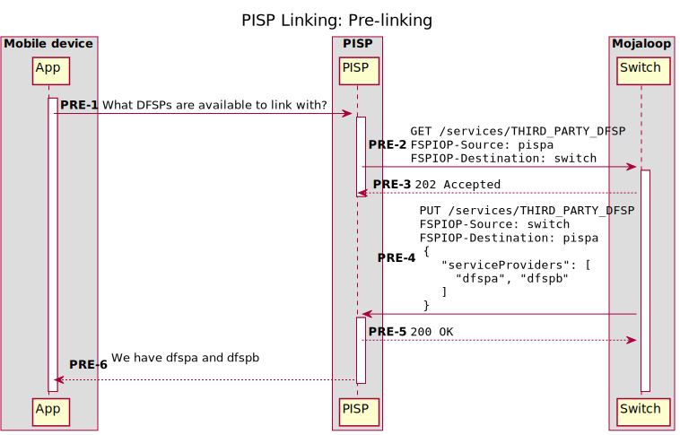

##  3.2 <a id='Discovery'></a>Discovery

In this phase, we ask the user to select the type and value of identifier they use
with the DFSP they intend to link with. This could be a username, MSISDN (phone number),
or email address.

The result of this phase is a list of potential accounts available for linking.
The user will then choose one or more of these source accounts and the PISP will
provide these to the DFSP when requesting consent.

The DFSP MAY send back an `accountNickname` to the PISP in the list of accounts. This list
will be displayed to the user in the PISP application for them to select which accounts
they wish to link. A DFSP could obfuscate some of the nickname depending on their requirements
for displaying account information without authorizing the user.

**NOTE:** When using the Web authentication channel, it's possible that the
choices made (i.e., the accounts to link with) will be overridden by the user in
a web view. In other words, the user may decide during the Authentication phase
that they actually would like to link a different account than those chosen at
the very beginning. This is perfectly acceptable and should be expected from
time to time.

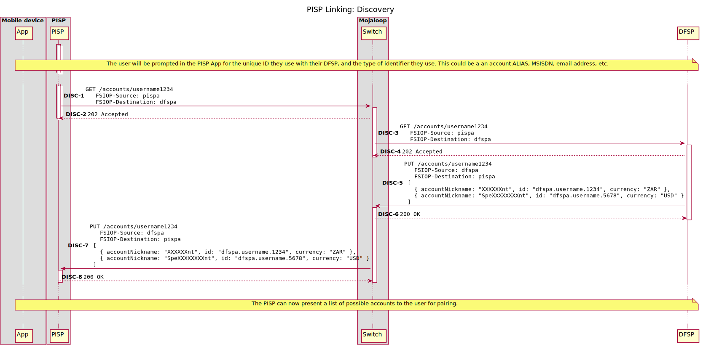

##  3.3 <a id='Requestconsent'></a>Request consent

In this phase, a PISP is asking a specific DFSP to start the process of
establishing consent between three parties:

1. The PISP
2. The specified DFSP
3. A User that is presumed to be a customer of the DFSP in (2)

The PISPs request to establish consent must include a few important pieces of
information:

- The authentication channels that are acceptable to the User
- The scopes required as part of the consent (in this case, almost always just
  the ability to view a balance of a specific account and send funds from an
  account).

Some information depends on the authentication channel used (either Web or OTP).
Specically, if the web authentication channel is used, the following extra
information is required:

- A callback URI of where a user can be redirected with any extra information.

The end result of this phase depends on the authentication channel used:

### 3.3.1 <a id='Web'></a>Web

In the web authentication channel, the result is the PISP being instructed on
a specific URL where this supposed user should be redirected. This URL should be
a place where the user can prove their identity (e.g., by logging in).


### 3.3.2 <a id='OTPSMS'></a>OTP / SMS

In the OTP authentication channel, the DFSP sends an 'out of bound' OTP message
to their user (e.g. over SMS or Email). The PISP prompts the user for this OTP
message, and includes it in the `authToken` field in the `PATCH /consentRequests/<ID>`
callback.

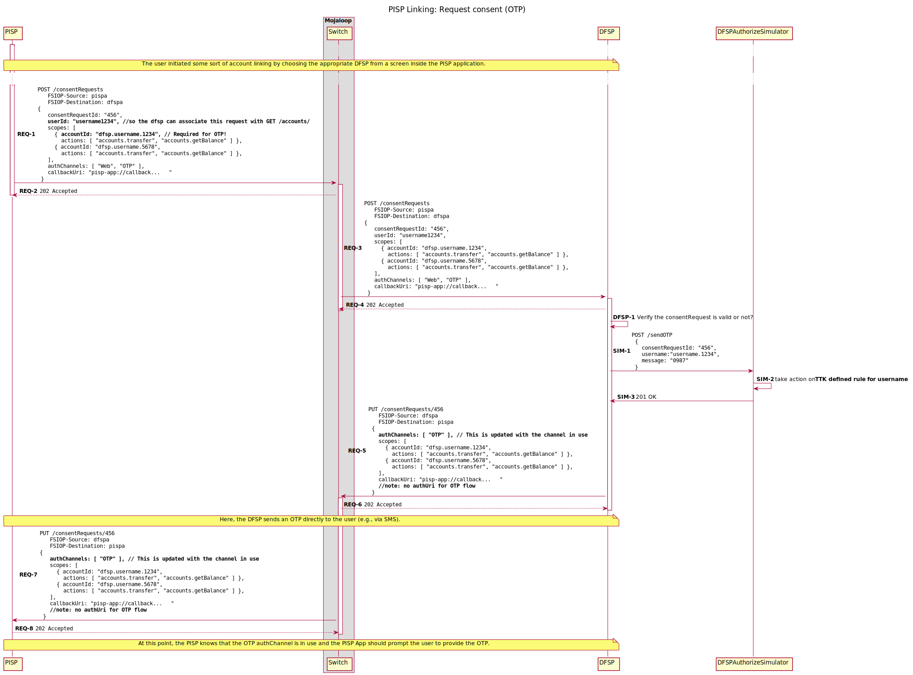

## 3.4 <a id='Authentication'></a>Authentication

In the authentication phase, the user is expected to prove their identity to the
DFSP. Once this is done, the DFSP will provide the User with some sort of secret
(e.g., an OTP or access token). This secret will then be passed along to the
PISP so that the PISP can demonstrate a chain of trust:

- The DFSP trusts the User
- The DFSP gives the User a secret
- The User trusts the PISP
- The User gives the PISP the secret that came from the DFSP
- The PISP gives the secret to the DFSP
- The DFSP verified that the secret is correct

This chain results in the conclusion: The DFSP can trust the PISP is acting on
behalf of the User, and mutual trust exists between all three parties.

The process of establishing this chain of trust depends on the authentication
channel being used:

### 3.4.1 <a id='Web-1'></a>Web

In the web authentication channel, the user is actually redirected to the DFSP's
website where they can prove their identity (likely by a typical username and
password style login).

<!-- TODO: add a comment about using the authUri field -->


**Note:** Keep in mind that at this stage, the User may update their choices of
which accounts to link with. The result of this will be seen later on when
during the Grant consent phase, where the DFSP will provide the correct values
to the PISP in the `scopes` field.

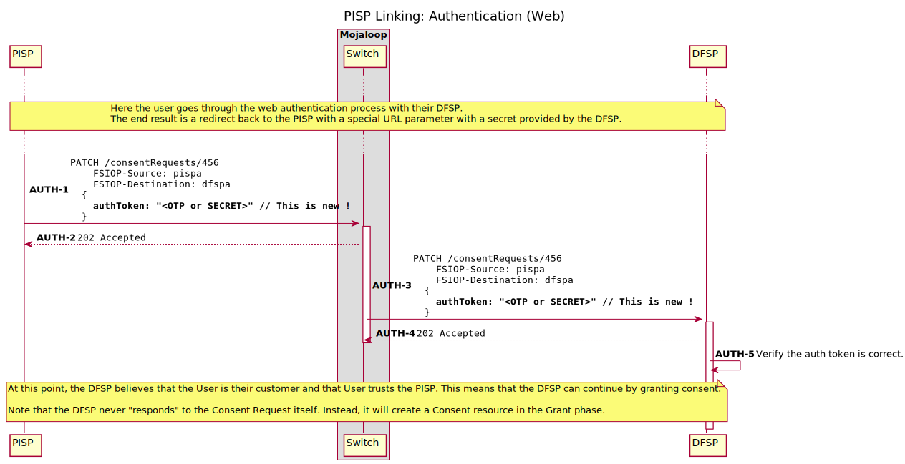


### 3.4.2 <a id='OTP'></a>OTP

<!-- TODO: add a comment about using the PATCH /consentRequest/{id} call -->

When using the OTP authentication channel, the DFSP will send the User some sort
of one-time password over a pre-established channel (most likely SMS). The PISP
should prompt the user for this one-time password and then provide that back to the DFSP.

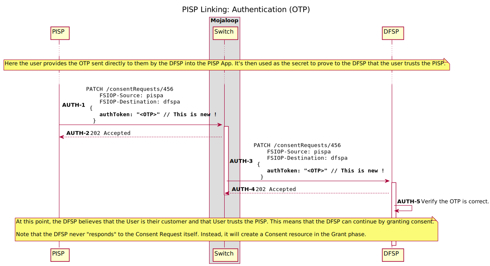
## 3.5 <a id='Grantconsent'></a>Grant consent

Now that mutual trust has been established between all three parties, the DFSP
is able to create a record of that fact by creating a new Consent resource.
This resource will store all the relevant information about the relationship
between the three parties, and will eventually contain additional information
for how the User can prove that it consents to each individual transfer in the
future.

This phase consists exclusively of the DFSP requesting that a new consent be
created.

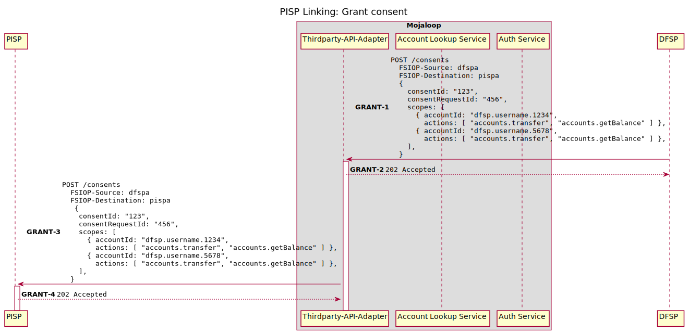


## 3.6 <a id='Credentialregistration'></a>Credential registration

Once the consent resource has been created, the PISP will attempt to establish
with the DFSP the credential that should be used to verify that a user has
given consent for each transfer in the future.

This will be done by storing a FIDO credential (e.g., a public key) on the Auth
service inside the consent resource. When future transfers are proposed, we will
require that those transfers be digitally signed by the FIDO credential (in this
case, the private key) in order to be considered valid.

This credential registration is composed of three phases: (1) deriving the
challenge, (2) registering the credential, and (3) finalizing the consent.

### 3.6.1 <a id='Derivingthechallenge'></a>Deriving the challenge

The PISP must derive the challenge to be used as an input to the FIDO Key
Registration step. This challenge must not be guessable ahead of time by
the PISP.


1. _let `consentId` be the value of the `body.consentId` in the `POST /consents` request_
2. _let `scopes` be the value of `body.scopes` in the `POST /consents` request_

3. The PISP must build the JSON object `rawChallenge`
```
{
   "consentId": <body.consentId>,
   "scopes": <body.scopes>
}
```

4. Next, the PISP must convert this json object to a string representation using a [RFC-8785 Canonical JSON format](https://tools.ietf.org/html/rfc8785)

5. Finally, the PISP must calculate a SHA-256 hash of the canonicalized JSON string.
i.e. `SHA256(CJSON(rawChallenge))`

The output of this algorithm, `challenge` will be used as the challenge for the [FIDO registration flow](https://webauthn.guide/#registration)


### 3.6.2 <a id='Registeringthecredential'></a>Registering the credential

Once the PISP has derived the challenge, the PISP will generate a new
credential on the device, digitally signing the challenge, and provide additional
information about the credential on the Consent resource:

1. The `PublicKeyCredential` object - which contains the key's Id, and an [AuthenticatorAttestationResponse](https://w3c.github.io/webauthn/#iface-authenticatorattestationresponse) which contains the public key
2. A `credentialType` field set to `FIDO`
3. a `status` field set to `PENDING`

> **Note:** Generic `Credential` objects
> While we are focused on FIDO first, we don't want to exclude PISPs who want
> to offer services to users over other channels, eg. USSD or SMS, for this
> reason, the API also supports a `GENERIC` Credential type, i.e.:
>```
> CredentialTypeGeneric {
>   credentialType: 'GENERIC'
>   status: 'PENDING',
>   payload: {
>     publicKey: base64(...),
>     signature: base64(...),
>   }
> }
>```

The DFSP receives the `PUT /consents/{id}` call from the PISP, and optionally
validates the Credential object included in the request body. The DFSP then
asks the Auth-Service to create the `Consent` object, and validate the Credential.

If the DFSP recieves a `PUT /consents/{id}` callback from the Auth-Service, with a
`credential.status` of `VERIFIED`, it knows that the credential is valid according
to the Auth Service.

Otherwise, if it recieves a `PUT /consents/{id}/error` callback, it knows that something
went wrong with registering the Consent and associated credential, and can inform
the PISP accordingly.


The Auth service is then responsible for calling `POST /participants/CONSENTS/{id}`.
This call will associate the `consentId` with the auth-service's `participantId` and
allows us to look up the Auth service given a `consentId` at a later date.

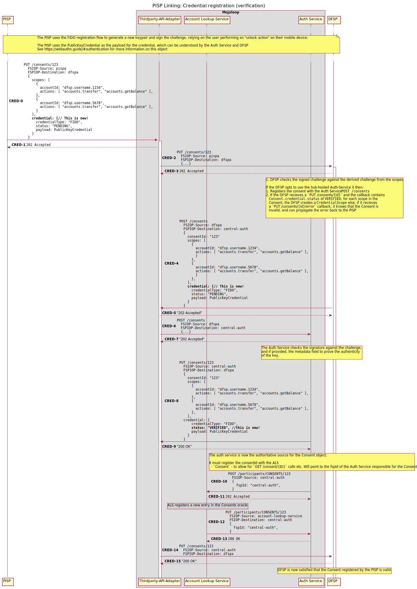


### 3.6.3 <a id='FinalizingtheConsent'></a>Finalizing the Consent

Once the DFSP is satisfied that the credential is valid, it calls
`POST /participants/THIRD_PARTY_LINK/{id}` for each account in the
`Consent.scopes` list. This entry is a representation of the account
link between the PISP and DFSP, which the PISP can use to specify
the _source of funds_ for the transaction request.

Finally, the DFSP calls `PUT /consent/{id}` with the finalized Consent
object it received from the Auth Service.


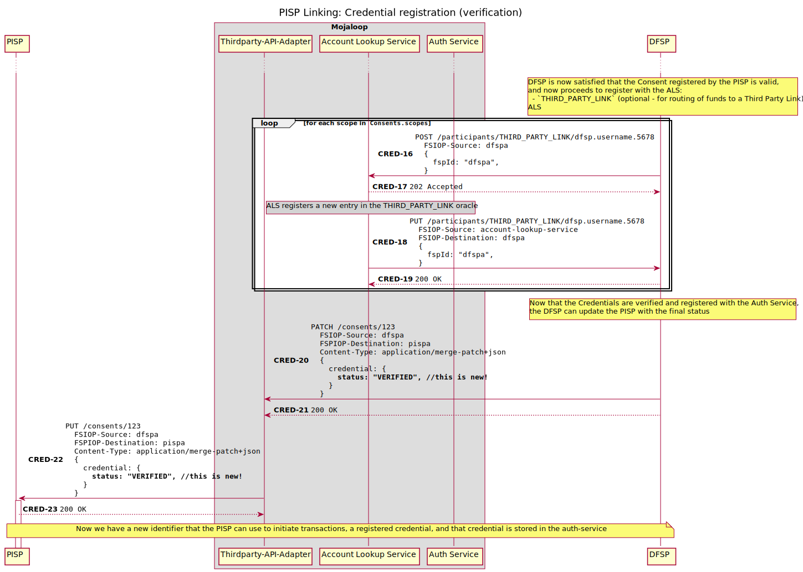


# 4. <a id='Unlinking'></a>Unlinking

At some point in the future, it's possible that a User, PISP, or DFSP may decide
that the relationship of trust previously established should no longer exist.
For example, a very common scenario might be a user losing their mobile device
and using an interface from their DFSP to remove the link between the lost
device, the PISP, and the DFSP.

To make this work, we simply need to provide a way for a member on the network
to remove the Consent resourse and notify the other parties about the removal.


There are 2 scenarios we need to cater for with a `DELETE /consents/{id}` request:
1. A DFSP-hosted Auth Service, where no details about the Consent are stored in the Switch, and
2. A Switch hosted Auth Service, where the Switch hosted auth service is considered the Authoritative source on the `Consent` object


## 4.1 <a id='UnlinkingwithoutaSwitchHostedAuthService'></a>Unlinking without a Switch Hosted Auth Service
In this case, the switch passes on the `DELETE /consents/123` request to the DFSP in the `FSPIOP-Destination` header.

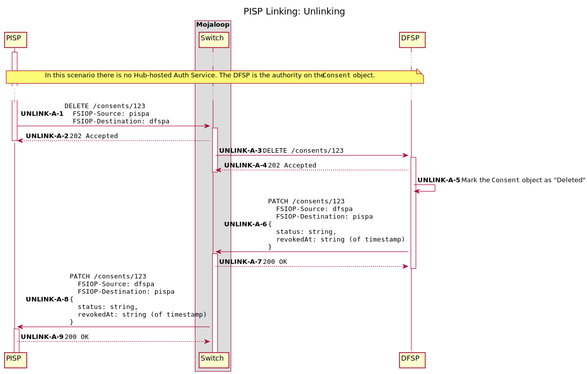

In the case where Unlinking is requested from the DFSP's side, the DFSP can
simply call `PATCH /consents/123` to inform the PISP of an update to the
`Consent` object.

## 4.2 <a id='UnlinkingwithaSwitchHostedAuthService'></a>Unlinking with a Switch Hosted Auth Service

In this instance, the PISP still addresses it's `DELETE /consents/123` call to the
DFSP, since it knows nothing

Internally, the switch will lookup the Authoritative source of the `Consent` object,
using the ALS Call, `GET /participants/CONSENT/{id}`. If it is determined that there
is a Switch hosted Auth Service which 'owns' this `Consent`, the HTTP call `DELETE /consents/{id}`
will be redirected to the Auth Service.


# 5.<a id='ErrorScenarios'></a>Error Scenarios

## 5.1 <a id='Discovery-1'></a>Discovery
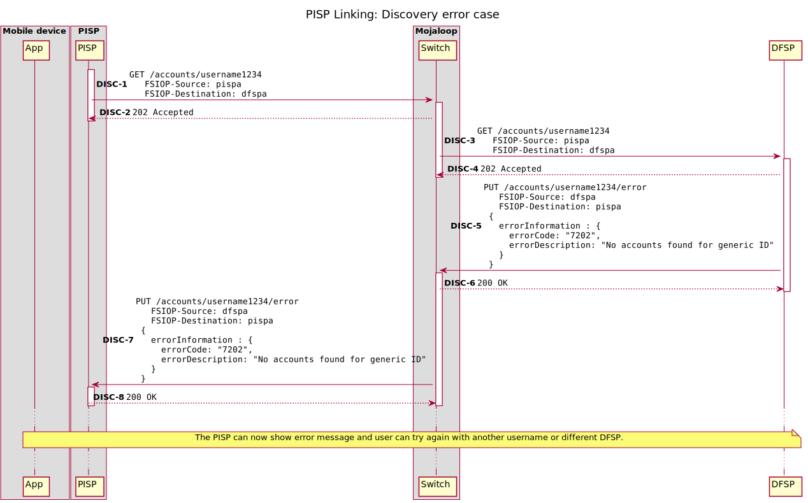

## 5.2 <a id='BadconsentRequests'></a>Bad consentRequests
When the DFSP receives the `POST /consentRequests` request from the PISP, any number of processing or validation errors could occur, such as:

1. FSP does not support any requested authentication channels (Error code: `7203`)
2. FSP does not support any requested scope actions (Error code: `7204`)
3. FSP does not find scopes suitable (Error code: `7209`)
4. FSP does not trust PISP callback URI (Error code: `7210`)
5. FSP does not allow consent requests for specified username (Error code: `7211`)
6. Any other checks or validation of the consentRequests on the DFSP's side fail (Error code: `7208`)

In this case, the DFSP must inform the PISP of the failure by sending a `PUT /consentRequests/{ID}/error` callback to the PISP.


## 5.3 <a id='Authentication-1'></a>Authentication
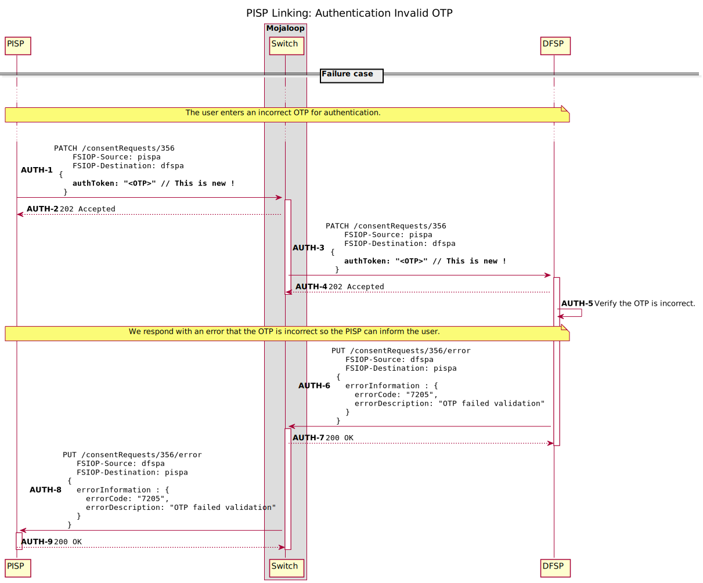

## 5.4 <a id='Grantconsent-1'></a>Grant consent
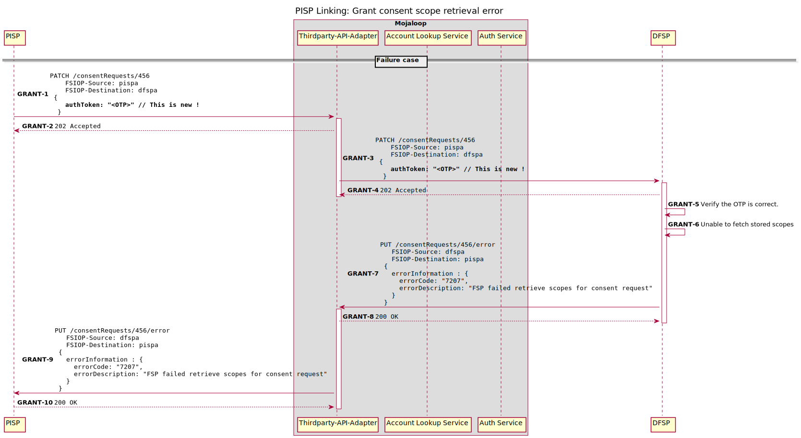
